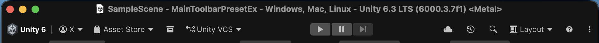
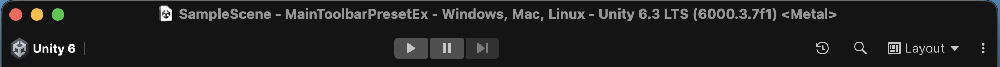

# MainToolbarPresetEx

An editor extension that automatically applies a preset to the Unity editor main toolbar.  
It uses reflection to access Unity’s internal `MainToolbarWindow` / `OverlayCanvas` and applies a preset that hides unwanted toolbar elements when the editor loads.

It can be useful when you want to provide the same UX to multiple people (e.g. across a team).

### Before

### After

## Features

- **Automatic preset application**: Applies the preset at `Assets/Settings/ToolbarPreset.asset` when the editor loads
- **Version tracking**: Stores the applied version in `EditorPrefs` so the preset is re-applied only when the preset logic changes

## Requirements

- Unity 6.3 or later

## Location

- **Script path**: [Unity.Misc/Assets/Scripts/Misc/Editor/MainToolbarPresetEx.cs](../Unity.Misc/Assets/Scripts/Misc/Editor/MainToolbarPresetEx.cs)

## Installation

1. Clone or download this repository.
2. Copy the `MainToolbarPresetEx` folder into your Unity project under `Assets` (or your preferred location).
3. Ensure `Assets/Settings/ToolbarPreset.asset` exists.  
   - If not, create a preset in the Unity editor via **Window → Overlays → Save Preset**, then save it at that path, or update `k_PresetPath` in `MainToolbarPresetEx.cs` to your actual preset path.

## Usage

- Opening the Unity editor applies the preset automatically; no extra steps are required.
- To change the preset, edit or replace `Assets/Settings/ToolbarPreset.asset` in Unity, then restart the editor.
- To force re-application, clear the stored version (e.g. **Edit → Clear All PlayerPrefs** or `EditorPrefs.DeleteKey("MainToolbarPresetEx.AppliedVersion")`), then restart the editor.

## Notes

- This extension uses reflection on Unity’s internal APIs (`MainToolbarWindow`, `OverlayCanvas`, `ApplyPreset`, etc.), so behavior may change or break after Unity version upgrades.
- If the preset file is missing, a warning is logged to the console and application of the preset is skipped.

## License

The rest of the xpTURN.AssetLink code is under the Apache License, Version 2.0. See [LICENSE](../LICENSE.md) for details.

## Links

- **License**: [LICENSE](../LICENSE.md)
- **Author**: [xpTURN](https://github.com/xpTURN)
